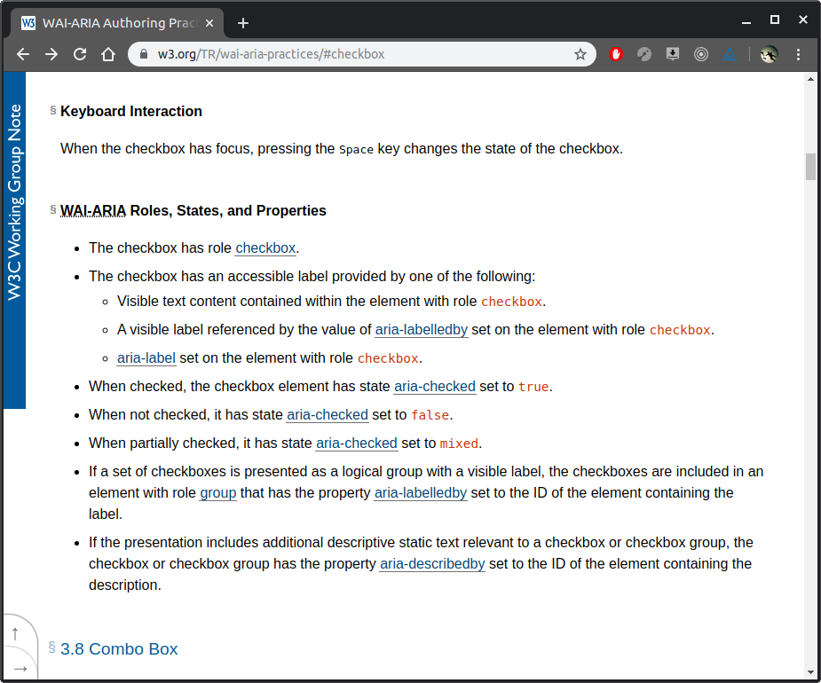

---


---


---


---

# A11Y

<p>
Randy Vroegop
</p>

<p>
linkedin.com/in/randy-vroegop
<p>

<randy>

</randy>

---

```html
<empower />
```

Note:
niet begrijpen = niet inspirerend
Snappen = willen werken
Empowerment

--

## Under the hood

```html
<html> <body> <table>
```

--

## DOM


```html
<table> 

<!-- stuff --> 

</table>
```

Note:
Daarvandaan weten sommige waarschijnlijk dat de browser HTML parsed en een DOM maakt
Een DOM is de representatie van elementen op de pagina, een collectie objecten vanuit de HTML

--

## GUI


Note:
Dom wordt een GUI

--

## A11Y tree


Note:
Dom wordt ook een A11Y tree

--


--

## A11Y tree


Note:
Uitgebreide DOM tree

--

## A11Y tree

HTML
```html
<head><title>How old are you?</title></head>
<body>
  <label for="age">Age</label>
  <input id="age" type="text" name="age" value="42">
  <div>
    <button>Next</button>
  </div>
</body>
```

A11Y
```py
id=1 role=WebArea name="How old are you?"
  id=2 role=Label name="Age"
  id=3 role=TextField labelledByIds=[2] value="42"
  id=4 role=Group
    id=5 role=Button name="Next"
```

Note:
Zie correlatie labelledByIds=[2] naar label verwijzen
group is generiek maar behulpzaam
Veel div is niet gemakkelijk voor de screenreader

Accessibility Events

Accessibility Actions

--

## A11Y tree

```html
<label for="seatType">Stoel voorkeur</label>
<select name="seatType" id="seatType">
  <option value=0>Geen voorkeur</option>
  <option value=1>Gangpad</option>
  <option value=2>Raamkant</option>
</select>
```

* Role: combobox <!-- .element: class="fragment" data-fragment-index="1" -->
* From label (for): label "Preferred seat type" <!-- .element: class="fragment" data-fragment-index="2" -->
* Expanded: false <!-- .element: class="fragment" data-fragment-index="3" -->
* Value: "Aisle seat" <!-- .element: class="fragment" data-fragment-index="4" -->
* Title:<!-- .element: class="fragment" data-fragment-index="5" --> *Not specified* <!-- .element: class="fragment" data-fragment-index="5" -->

Note:
A11Y tree wordt opgebouwd door
Role
Expanded
Value
Title (leeg)

--

## A11Y made accessible!


Note:
Voorbeeld van Chrome Accessibility pane

---

## Implicit semantics

<p>Net als *focus* krijgen specifieke elementen **rich semantics** zonder moeite.</p>

<p>&nbsp;</p>

<div class="large-font">
<input type="text" placeholder="Username">
*"textfield"*

<p>&nbsp;</p>

<button>Click me!</button>
*"Button"*

<p>&nbsp;</p>

<select><option>Gangpad</option></select>
*"combobox"*
</div>

Note:
Als je de juiste elementen juist gebruikt hoef je geen extra actie te ondernemen

--

## Semantic HTML

<p>Sommige elementen gedragen zich als **secties**. Screenreaders kunnen hier snel tussen navigeren.</p>

<p>&nbsp;</p>

```
<h1>...<h6>

<main>

<nav>

<footer>
```

Note:
Gebruikers van screenreaders gebruiken op onbekende websites vaak header elementen om snel te navigeren.

--


Note:
Voorbeeld gebruik van een screenreader voor navigatie

--

## WebAIM

Voorbeeld van een goed navigeerbare site via Keyboard

<a href="https://webaim.org" target="_blank">WebAim</a>

Note:
Voorbeeld gebruik van een screenreader voor navigatie

--

## Semantics

<p>Generieke elementen hebben generieke semantics.</p>

<div class="large-font">
  <button>Sign Up</button>
</div>

```html
<div class="sign-up" tabindex="0">
  Sign Up
</div>
```

### "Sign Up, group"

Note:
Geen screenreader weet dat het een button is vanwege div

--

## Don't make life hard
Gebruik de juiste elementen op de juiste plek.

Note:
Gebruik liever de checkbox dan een DIV ook als je wilt stijlen óf bouw aria in
Gebruik header, main, aside, footer, section, article

--

## Don't make life hard

Gebruik header, main, aside, footer, section, article

--

## Don't make life hard

* Section is een stuk van een pagina die uit een stuk bestaat
* Article is een sluitend stuk content. 

Note:
Als je article leest vereist het geen context - tot op zekere hoogte

---

## WAI-ARIA

<p>De Web Accessibility Initiative - Accessible Rich Internet Applications (ARIA) specificatie geeft developers de mogelijkheid om de **betekenis** van elementen in de DOM te **wijzigen en verbeteren**.</p>

--

## ARIA veranderd geen gedrag

Note:


--

## ARIA vult het gat in de A11Y tree

--


--

## Hoe leer ik ARIA?

--

### ARIA spec.


--

## w3.org/TR/wai-aria-practices/

<a href="https://www.w3.org/TR/wai-aria-practices" target="_blank">aria</a>

--



---

## Live Coding

Almost live coding.

--

```html
<html lang="en" class="inited">  

  <!-- styles -->  

<body>
    <div id="myCheckbox" 
         class="checkbox" 
         checked="false" 
         tabindex="0">
    </div>

  <!-- script -->  
  
</body>
</html>
```

--


--

```html
<html lang="en" class="inited">  

  <!-- styles -->  

<body>
    <div id="myCheckbox" 
         class="checkbox" 
         checked="false" 
         tabindex="0"
         role="checkbox"
         aria-checked="false"
         aria-label="Nieuwsbrief ontvangen">
    </div>

  <!-- script -->  
  
</body>
</html>
```

--


--

## Click

```js
  $menuItem.bind({
      click: function () {
          $subMenu.removeClass('is-show');
          if ($(this).next($subMenu)) {
              $(this).next($subMenu).addClass('is-show');
          }
      },

      blur: function () {
          $subMenu.removeClass('is-show');
      }
  });
```

--

## Click -> Focus

```js
  $menuItem.bind({
      focus: function () {
          $subMenu.removeClass('is-show');
          if ($(this).next($subMenu)) {
              $(this).next($subMenu).addClass('is-show');
          }
      },

      blur: function () {
          $subMenu.removeClass('is-show');
      }
  });
```

--

## Hover -> Focus

```css
  .access-menu a:hover,
  .access-menu a:focus {
      background: #369;
      outline: none;
  }
```

---

## Labels helpen het doel van een element te begrijpen

--

```html 
 
```

--

```html 
<label>
  Super handig!
  <input type="text">
</label>
```

--

```html 
<label for="forSomeElementId">
</label>
```

--

## Dit werkt niet

```html 
<label for="elementOne">
  <div id="elementOne"></div>
</label>
```

--

## aria-label


```html 
  <div aria-label="Open menu" class="hamburgerMenuIcon"></div>
```

--

## aria-labelledby

<div class="large-font">
  <p id="one">Vrouwenschoenen</p>
  <p id="two">Voor binnen</p>
  <button aria-labelledby="one two">Nu shoppen</button>
</div>

```html 
  <h1 id="one">Vrouwenschoenen</h1>
  <h2 id="two">Voor binnen</h2>
  <button aria-labelledby="one two">Nu shoppen</button>
```

---

## Way of working

--

## Single point of contact

--

## Extensions, Lighthouse

--

## Build pipeline

---

## Tools

--

## Videocast by Chrome Team

youtube.com/playlist?list=PLNYkxOF6rcICWx0C9LVWWVqvHlYJyqw7g

(bit.ly/a11ycasts)

--

## Google A11Y Fundamentals

developers.google.com/web/fundamentals/accessibility/

(bit.ly/a11y-fundamentals)

--

## Lighthouse

Chrome -> <kdb>F12</kdb> -> Audits -> Accessibility

--

## Wave browser extension

wave.webaim.org

Scanner die A11Y problemen kan detecteren.

* Font-size
* Contrast
* Aria-labels & alt-text
* etc.

--

## Axe browser extension

deque.com/axe/

Scanner die A11Y problemen kan detecteren.

* Font-size
* Contrast
* Aria-labels & alt-text
* etc.

--

## Ontwikkelstraat

aslint.org

Scanner voor A11Y in de build pipeline

---

### Bedankt

* Slides zijn beschikbaar op aanvraag